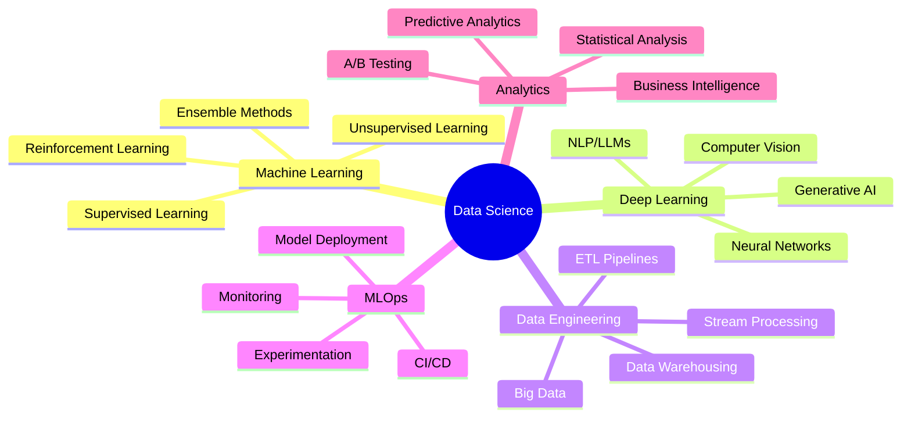

# 👋 Hello, I'm **Arya Gupta** 
### 🔬 Data Scientist | 🤖 ML Engineer | 📊 Analytics Expert

<div align="center">
  
  
  
</div>

---

## 🧠 **About Me**

> *"In God we trust, all others bring data."* - W. Edwards Deming

I'm a passionate **Data Scientist** who thrives on transforming raw data into actionable intelligence. My expertise spans the entire data science pipeline—from data acquisition and preprocessing to model deployment and MLOps. I specialize in uncovering hidden patterns, building predictive models, and creating compelling data narratives that drive business decisions.

**What drives me:**
- 🔍 **Data Detective**: Love diving deep into complex datasets to extract meaningful insights
- 🎯 **Problem Solver**: Passionate about solving real-world challenges with data-driven approaches  
- 🚀 **Innovation Enthusiast**: Always exploring cutting-edge ML/AI technologies and methodologies
- 📈 **Impact Creator**: Focused on delivering measurable business value through analytics

---

## 🎯 **Current Focus**

```python
current_projects = {
    "primary": ["MLOps Pipeline Development", "Production ML Systems"],
    "learning": ["FastAPI for ML Deployment", "Advanced Deep Learning"],
    "interests": ["Generative AI", "MLOps Best Practices", "Data Analytics"],
    "collaboration": "Open Source ML Projects"
}
```

---

## 🛠️ **Technical Arsenal**

### **Programming & Core Technologies**
<div align="left">
  
  
</div>

### **Machine Learning & Deep Learning**
<div align="left">
  
  
  
  
  
  
</div>

### **Data Processing & Analysis**
<div align="left">
  
  
  
  
</div>

### **Data Visualization & BI**
<div align="left">
  
  
  
  
</div>

### **MLOps & Cloud Infrastructure**
<div align="left">
  
  
  
</div>

### **Development Tools & Environment**
<div align="left">
  
  
  
  
  
  
</div>

### **Databases & Big Data**
<div align="left">
  
</div>

### **GEN AI**
<div align="left">
  
</div>

---

## 📊 **GitHub Analytics**

<div align="center">
  
  
  
  
  
</div>

<div align="center">
  
  
</div>

<div align="center">
  
  
  
</div>

---

---

## 💡 **Specializations**



---


<!--
## 📈 **Featured Projects**

<div align="center">

| 🔗 **Project** | 🛠️ **Tech Stack** | 📊 **Domain** |
|:---------------|:-------------------|:---------------|
| [🎯 Customer Churn Prediction](https://github.com/realaryagupta) | Python, XGBoost, MLflow | Business Analytics |
| [🧠 NLP Sentiment Analysis](https://github.com/realaryagupta) | TensorFlow, BERT, FastAPI | Natural Language Processing |
| [📱 Computer Vision App](https://github.com/realaryagupta) | PyTorch, OpenCV, Streamlit | Computer Vision |
| [⚡ Real-time ML Pipeline](https://github.com/realaryagupta) | Apache Kafka, Docker, K8s | MLOps |

</div>
-->


---

## 🌐 **Let's Connect & Collaborate**

<div align="center">

[](https://www.linkedin.com/in/arya-gupta-9b5873218)
[](https://www.x.com/realaryagupta)
[](https://kaggle.com/realaryagupta)
[](mailto:aryagupta2108.ag@gmail.com)
[](https://realaryagupta.github.io/my_portfolio/)

</div>

---

## 💬 **Let's Talk Data!**

I'm always excited to discuss:
- 🤖 **Machine Learning**: Latest algorithms, model optimization, and deployment strategies
- 📊 **Data Analytics**: Statistical methods, experimental design, and business insights
- 🧠 **AI Research**: Deep learning breakthroughs, LLMs, and generative AI
- 🚀 **MLOps**: Best practices, automation, and scalable ML systems
- 🤝 **Collaboration**: Open source projects, research partnerships, and knowledge sharing

---

<div align="center">
  
### 📫 **Ready to transform data into impact? Let's connect!**

*"The goal is to turn data into information, and information into insight."* - Carly Fiorina


</div>

---

<div align="center">
  
</div>
